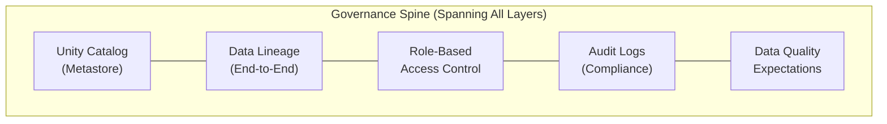
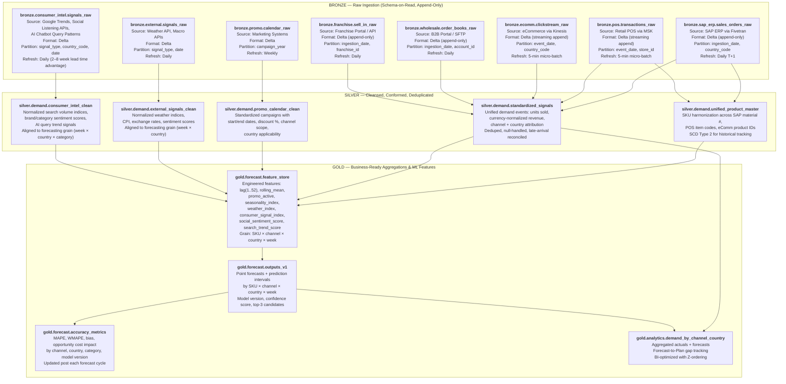
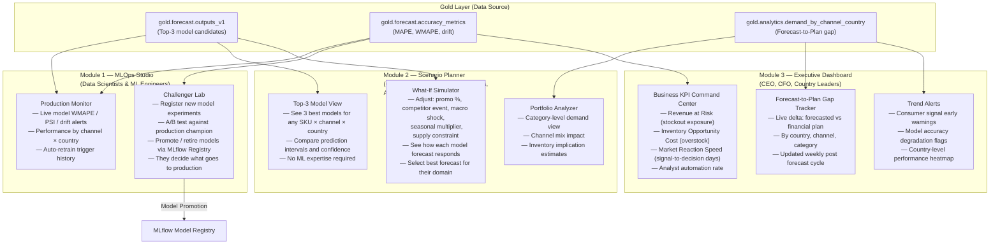
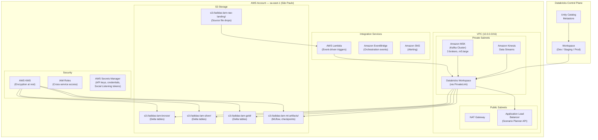
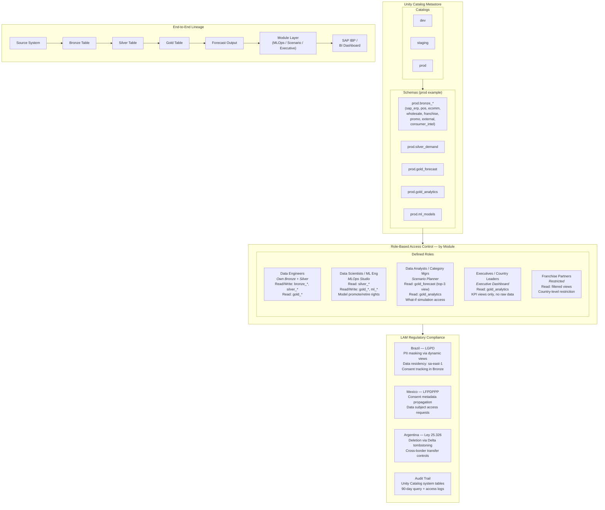

# Architecture Diagrams — adidas LAM Demand Forecasting Platform

## A. End-to-End Platform Overview

```mermaid
graph LR
    subgraph Sources["Source Systems"]
        SAP["SAP ERP<br/>(Orders, Inventory,<br/>Product Master)"]
        POS["Retail POS<br/>(Transactions,<br/>Foot Traffic)"]
        ECOM["eCommerce<br/>(Clickstream,<br/>Conversions)"]
        WHL["Wholesale<br/>(Order Books,<br/>Sell-Through)"]
        FRN["Franchise<br/>(Sell-In Orders,<br/>Commitments)"]
        PROMO["Promo Calendars<br/>(Campaigns,<br/>Discounts)"]
        EXT["External Signals<br/>(Weather, Macro)"]
        CI["Consumer Intelligence<br/>(Google Trends, Social<br/>Listening, AI Chatbots)"]
    end

    subgraph Ingestion["Ingestion Layer"]
        MSK["AWS MSK<br/>(Kafka)"]
        KIN["AWS Kinesis<br/>Data Streams"]
        S3R["AWS S3<br/>(Raw Landing)"]
        LMB["AWS Lambda<br/>(Event Triggers)"]
    end

    subgraph Lakehouse["Databricks Lakehouse"]
        subgraph Bronze["Bronze Layer<br/>(Raw, Append-Only)"]
            B1["bronze.sap_erp.*"]
            B2["bronze.pos.*"]
            B3["bronze.ecomm.*"]
            B4["bronze.wholesale.*"]
            B5["bronze.franchise.*"]
            B6["bronze.promo.*"]
            B7["bronze.external.*"]
            B8["bronze.consumer_intel.*"]
        end

        subgraph Silver["Silver Layer<br/>(Cleansed, Conformed)"]
            S1["Unified Product<br/>Master"]
            S2["Standardized<br/>Demand Signals"]
            S3["Promo Calendar<br/>(Clean)"]
            S4["External + Consumer<br/>Signals (Normalized)"]
        end

        subgraph Gold["Gold Layer<br/>(Business-Ready)"]
            G1["ML Feature<br/>Tables"]
            G2["Forecast<br/>Outputs"]
            G3["Accuracy<br/>Metrics"]
            G4["Aggregated<br/>Demand Views"]
        end

        subgraph ML["ML Platform"]
            FS["Feature Store"]
            TR["Training<br/>Orchestration"]
            MR["MLflow Model<br/>Registry"]
            SRV["Model Serving<br/>(Batch + On-Demand)"]
            MON["Monitoring<br/>(Drift, Accuracy)"]
        end
    end

    subgraph Modules["Platform Modules (User Experience Layer)"]
        M1["MLOps Studio<br/>(Data Scientists)<br/>Production Monitor +<br/>Challenger Lab"]
        M2["Scenario Planner<br/>(Data Analysts &<br/>Category Managers)<br/>What-If Simulation +<br/>Top-3 Model Selection"]
        M3["Executive Dashboard<br/>(C-Level & Country Leaders)<br/>Forecast-to-Plan Gap +<br/>Business KPI Tracking"]
    end

    subgraph Downstream["Downstream Systems"]
        IBP["SAP IBP<br/>(Supply Chain)"]
        BI["BI Dashboards<br/>(Tableau / Power BI)"]
    end

    %% Source to Ingestion
    SAP -->|"Batch (Daily)"| S3R
    POS -->|"Streaming"| MSK
    ECOM -->|"Streaming"| KIN
    WHL -->|"Batch (Daily)"| S3R
    FRN -->|"Batch (Daily)"| S3R
    PROMO -->|"Batch (Weekly)"| S3R
    EXT -->|"Batch (Daily)"| S3R
    CI -->|"Batch (Daily)"| S3R

    %% Ingestion to Bronze
    S3R --> LMB --> Bronze
    MSK --> Bronze
    KIN --> Bronze

    %% Medallion Flow
    Bronze -->|"Delta Live Tables"| Silver
    Silver -->|"Delta Live Tables"| Gold

    %% ML Flow
    Gold --> FS --> TR --> MR --> SRV
    SRV --> G2
    MON --> TR

    %% Gold to Modules
    G2 --> M1
    G3 --> M1
    G2 --> M2
    G4 --> M2
    G3 --> M3
    G4 --> M3

    %% Modules to Downstream
    M1 -->|"Model Promotion"| MR
    M2 -->|"Selected Forecast"| IBP
    M3 --> BI
    G2 --> IBP
```

---

## B. Medallion Architecture Detail

---

## C. Three-Module User Experience Layer

---

## D. ML Pipeline Architecture

```mermaid
graph LR
    subgraph FeatureEng["Feature Engineering"]
        FS["Databricks<br/>Feature Store<br/>(Unity Catalog)"]
        FT["Feature Tables<br/>(gold.forecast.<br/>feature_store)<br/>incl. consumer_signal_index<br/>search_trend_score"]
    end

    subgraph Training["Training Orchestration"]
        WF["Databricks<br/>Workflows<br/>(Scheduled Weekly)"]
        STAT["Statistical Models<br/>(Prophet, ETS)"]
        ML["ML Models<br/>(LightGBM, XGBoost)"]
        DL["Deep Learning<br/>(TFT, N-BEATS)"]
        ENS["Ensemble Layer<br/>(Weighted Stacking)"]
    end

    subgraph Registry["Model Registry"]
        MLF["MLflow<br/>Model Registry"]
        STG["Staging"]
        PRD["Production<br/>(Top-3 exposed<br/>to Scenario Planner)"]
        CHMP["Champion /<br/>Challenger<br/>(MLOps Studio)"]
    end

    subgraph Serving["Model Serving"]
        BATCH["Batch Scoring<br/>(Primary)<br/>Databricks Workflows<br/>→ Gold Tables"]
        RT["On-Demand Serving<br/>(Secondary)<br/>Databricks Model Serving<br/>→ Scenario Planner API"]
    end

    subgraph Monitoring["Monitoring & Drift"]
        MAPE["Forecast Accuracy<br/>(MAPE / WMAPE)"]
        PSI["Feature Drift<br/>(PSI)"]
        CI_MON["Consumer Signal<br/>Freshness Monitor<br/>(API quotas, gaps)"]
        ALERT["Alerting<br/>(PagerDuty / Slack)"]
        RETRAIN["Auto-Retrain<br/>Trigger"]
    end

    FS --> FT --> WF
    WF --> STAT
    WF --> ML
    WF --> DL
    STAT --> ENS
    ML --> ENS
    DL --> ENS

    ENS --> MLF
    MLF --> STG --> PRD
    MLF --> CHMP

    PRD --> BATCH
    PRD --> RT

    BATCH --> MAPE
    MAPE --> PSI --> ALERT
    CI_MON --> ALERT
    ALERT --> RETRAIN --> WF
```

---

## E. AWS Infrastructure

---

## F. Data Governance Model

