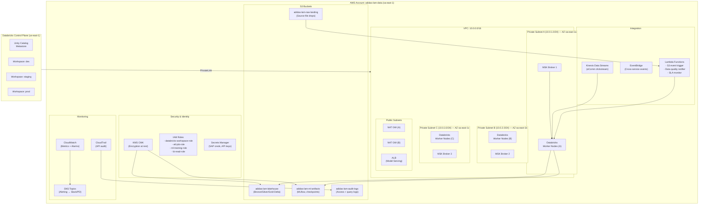

# AWS Infrastructure — adidas LAM Demand Forecasting Platform

## 1. Infrastructure Overview



---

## 2. Compute Strategy

| Workload | Cluster Type | Instance Type | Scaling | Cost Optimization |
|----------|-------------|---------------|---------|-------------------|
| **Bronze Ingestion (Streaming)** | Jobs Compute, always-on | `i3.xlarge` (4 vCPU, 30 GB) | 2-6 workers, auto-scale on backlog | Spot instances with on-demand fallback |
| **Bronze Ingestion (Batch)** | Jobs Compute, ephemeral | `i3.xlarge` | 2-8 workers, auto-scale | 100% Spot (retried on preemption) |
| **Silver/Gold DLT Pipelines** | DLT Pipeline Compute | `i3.2xlarge` (8 vCPU, 61 GB) | 4-16 workers, auto-scale | Spot with on-demand driver; Enhanced autoscaling |
| **ML Training (Statistical)** | Jobs Compute, ML Runtime | `m5.4xlarge` (16 vCPU, 64 GB) | 4-8 workers | Spot instances, scheduled off-peak (02:00-06:00 UTC-3) |
| **ML Training (Deep Learning)** | Jobs Compute, ML GPU Runtime | `g5.xlarge` (1 GPU, 24 GB VRAM) | 2-4 workers | Spot instances, GPU quota reservation |
| **Batch Scoring** | Jobs Compute, ML Runtime | `m5.2xlarge` (8 vCPU, 32 GB) | 2-4 workers | Spot, weekly schedule |
| **SQL Analytics / BI** | SQL Serverless Warehouse | Managed (serverless) | Auto-scaling, 1-8 clusters | Pay-per-query, auto-stop 10 min |
| **Model Serving (API)** | Serverless Model Endpoints | Managed (serverless) | Auto-scaling, scale-to-zero | Pay-per-request, min 0 instances |
| **Interactive Dev/Exploration** | All-Purpose Clusters | `m5.xlarge` (4 vCPU, 16 GB) | 1-4 workers | Auto-terminate 30 min idle, Spot workers |

### Estimated Monthly Compute Cost (Steady State — Phase 2+)

| Component | DBU/month | Estimated Cost (USD) |
|-----------|----------|---------------------|
| DLT Pipelines (Silver/Gold) | ~15,000 | $6,000 - $8,000 |
| Jobs Compute (Ingestion + Scoring) | ~10,000 | $4,000 - $5,000 |
| ML Training | ~8,000 | $3,500 - $5,000 |
| SQL Serverless (BI) | ~5,000 | $2,500 - $3,500 |
| Model Serving | ~2,000 | $1,000 - $1,500 |
| Interactive Clusters | ~3,000 | $1,200 - $1,800 |
| **Total Databricks** | **~43,000** | **$18,200 - $24,800** |
| AWS Infrastructure (S3, MSK, Kinesis, Lambda, NAT) | — | $4,000 - $6,000 |
| **Total Platform** | — | **$22,200 - $30,800** |

*Estimates based on sa-east-1 pricing. Actual costs depend on data volumes, query patterns, and optimization. Phase 0-1 will be ~40% of steady state.*

---

## 3. S3 Bucket Strategy

| Bucket | Purpose | Lifecycle | Encryption | Access |
|--------|---------|-----------|------------|--------|
| `adidas-lam-raw-landing` | Raw file drops from sources | 90 days → Glacier, 365 days → delete | KMS CMK | ETL role write, Databricks read |
| `adidas-lam-lakehouse` | Delta tables (Bronze/Silver/Gold) | No expiration (Delta manages) | KMS CMK | Databricks workspace role |
| `adidas-lam-ml-artifacts` | MLflow experiments, model artifacts, checkpoints | No expiration | KMS CMK | ML training role |
| `adidas-lam-audit-logs` | CloudTrail, query logs, Unity Catalog audit | 365 days → Glacier, 7 years → delete | KMS CMK | Security team read-only |

### Bucket Organization (Lakehouse)

```
s3://adidas-lam-lakehouse/
├── bronze/
│   ├── sap_erp/
│   │   ├── sales_orders_raw/         (Delta table)
│   │   ├── inventory_snapshots_raw/  (Delta table)
│   │   └── material_master_raw/      (Delta table)
│   ├── pos/
│   │   └── transactions_raw/         (Delta table)
│   ├── ecomm/
│   │   ├── clickstream_raw/          (Delta table)
│   │   └── orders_raw/               (Delta table)
│   ├── wholesale/
│   │   ├── order_books_raw/          (Delta table)
│   │   └── sell_through_raw/         (Delta table)
│   ├── franchise/
│   │   └── sell_in_raw/              (Delta table)
│   ├── promo/
│   │   └── calendar_raw/             (Delta table)
│   └── external/
│       ├── weather_raw/              (Delta table)
│       ├── macro_raw/                (Delta table)
│       └── trends_raw/               (Delta table)
├── silver/
│   └── demand/
│       ├── unified_product_master/   (Delta table, SCD2)
│       ├── standardized_signals/     (Delta table)
│       ├── promo_calendar_clean/     (Delta table)
│       └── external_signals_clean/   (Delta table)
└── gold/
    ├── forecast/
    │   ├── feature_store/            (Delta table)
    │   ├── outputs_v1/               (Delta table)
    │   └── accuracy_metrics/         (Delta table)
    └── analytics/
        └── demand_by_channel_country/ (Delta table, Z-ordered)
```

---

## 4. Network Architecture

### Databricks Connectivity
- **PrivateLink** from Databricks data plane (in-VPC) to Databricks control plane (us-east-1)
- **VPC Endpoints** for S3, KMS, Secrets Manager, CloudWatch (no internet traversal for data)
- **Transit Gateway** or **VPC Peering** for connectivity to on-premise SAP systems (if applicable)

### MSK Configuration
- **3 brokers** across 3 AZs for high availability
- **Instance type:** `kafka.m5.large` (enough for ~50K messages/sec)
- **Topics:** `pos-transactions`, `ecomm-orders` (partitioned by country_code, 12 partitions each)
- **Retention:** 7 days (Bronze is the durable store)
- **Encryption:** TLS in-transit, KMS at-rest

### Kinesis Configuration
- **Stream:** `ecomm-clickstream`
- **Shards:** 16 (supports ~16 MB/sec ingest, ~200M events/day)
- **Retention:** 24 hours (Bronze is the durable store)
- **Enhanced fan-out** for Databricks consumer (dedicated throughput)

---

## 5. Disaster Recovery

| Component | Strategy | RPO | RTO |
|-----------|----------|-----|-----|
| S3 Data | Cross-region replication to us-east-1 | < 15 min | < 1 hour |
| Delta Tables | Delta time travel (30 days) + S3 versioning | 0 (point-in-time) | < 30 min (RESTORE) |
| MSK Topics | Multi-AZ replication (built-in) | 0 | Automatic failover |
| Databricks Config | Terraform state in S3 + Git | 0 | < 2 hours (re-deploy) |
| MLflow Artifacts | S3 cross-region replication | < 15 min | < 1 hour |
| Unity Catalog | Databricks-managed HA | 0 | Automatic |

---

## 6. Infrastructure as Code

All infrastructure managed via **Terraform** with the following module structure:

```
infra/
├── modules/
│   ├── vpc/              # VPC, subnets, NAT, endpoints
│   ├── s3/               # Buckets, policies, lifecycle rules
│   ├── msk/              # MSK cluster, topics, security
│   ├── kinesis/          # Kinesis streams, enhanced fan-out
│   ├── kms/              # CMK keys, key policies
│   ├── iam/              # Roles, policies, instance profiles
│   ├── databricks/       # Workspace, cluster policies, Unity Catalog
│   └── monitoring/       # CloudWatch, alarms, SNS, dashboards
├── environments/
│   ├── dev/
│   ├── staging/
│   └── prod/
├── backend.tf            # S3 + DynamoDB state backend
└── versions.tf           # Provider versions pinned
```

**CI/CD for Infrastructure:**
- GitHub Actions pipeline: `terraform plan` on PR, `terraform apply` on merge to main
- Separate state files per environment
- Policy-as-code with **OPA/Sentinel** for guardrails (e.g., no public S3 buckets, KMS encryption required)
